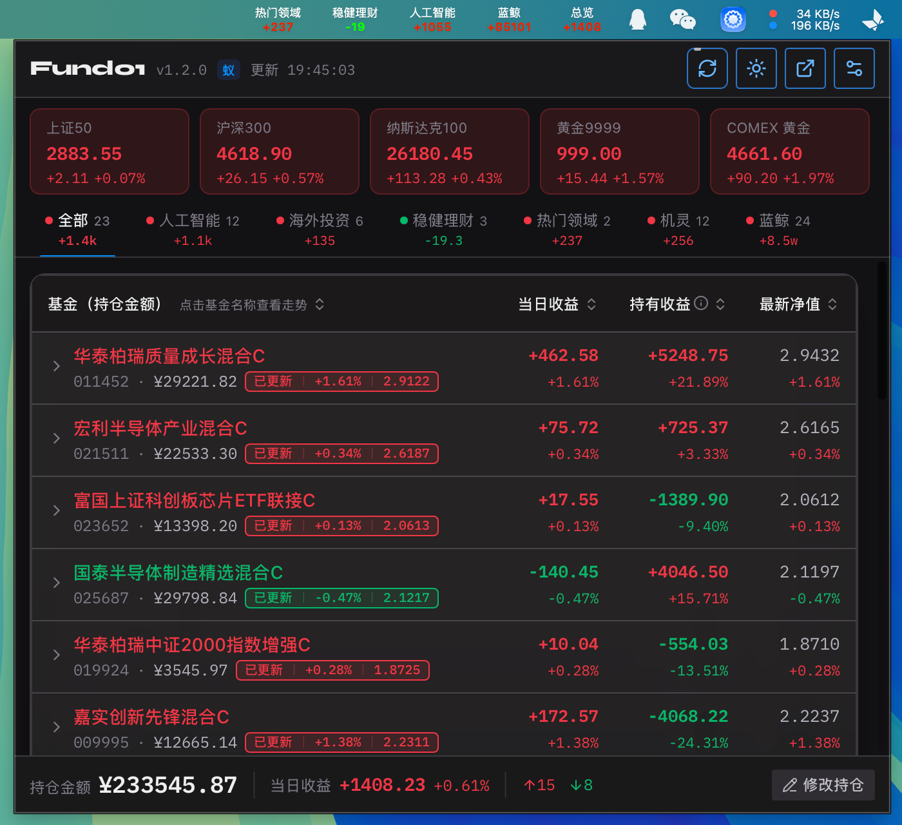
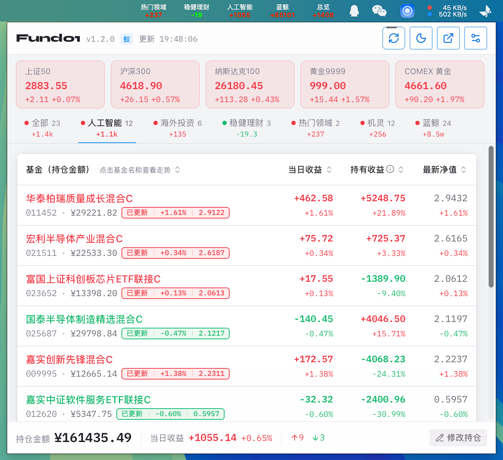
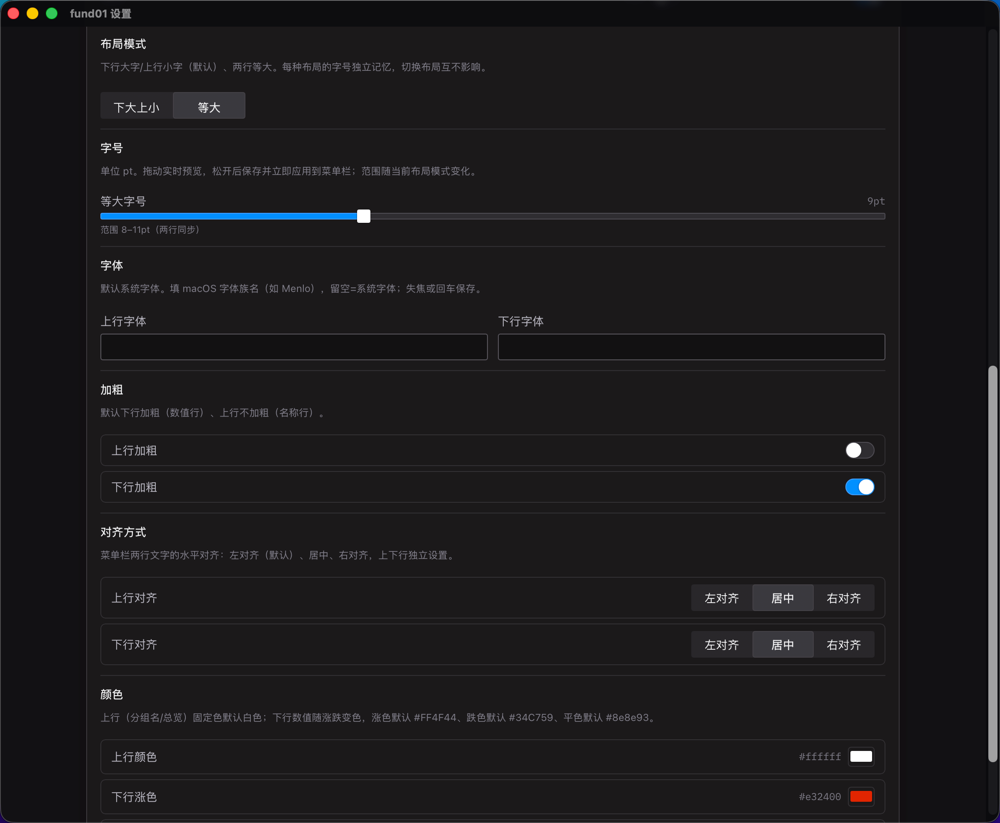
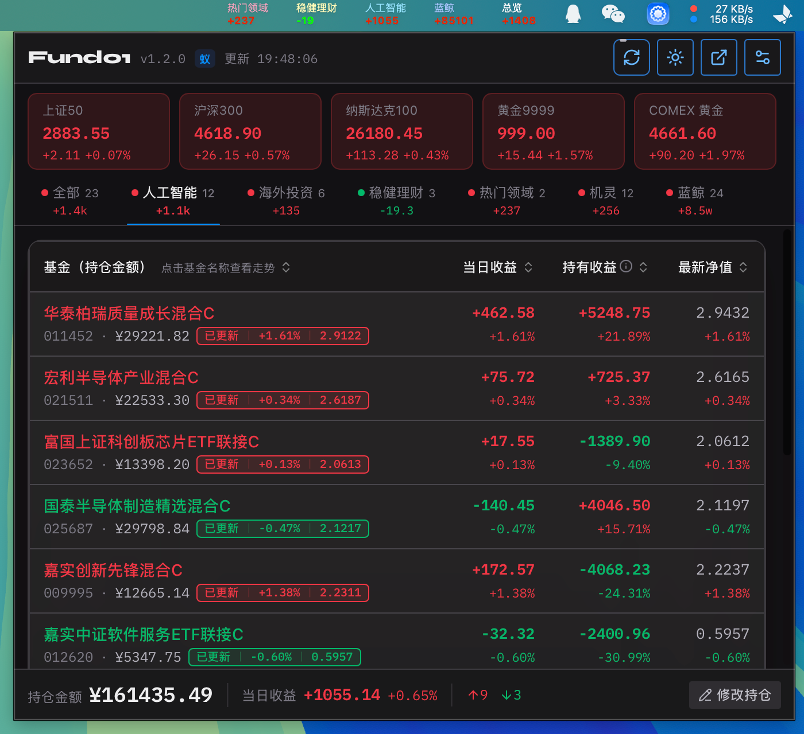
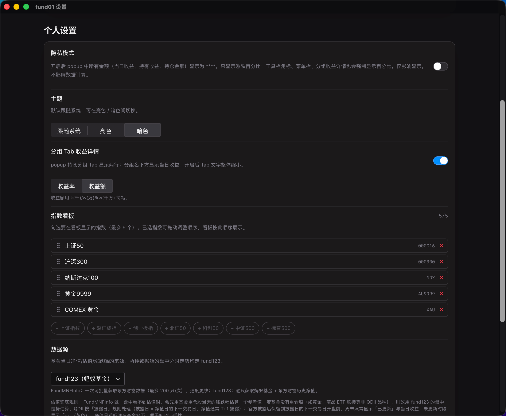

# Fund01

Fund01 是一个基金持仓盯盘工具，提供 Chrome 扩展与桌面应用两种形态。桌面端基于 Tauri 2，已支持 **macOS**（菜单栏常驻）和 **Windows**（任务栏常驻）两个平台，三者复用同一套前端代码（`packages/ui`），通过 Port 接口适配不同运行时。

macOS 桌面端以菜单栏（menubar）常驻方式运行：每个持仓分组对应一根独立的菜单栏实例，实时显示该分组的当日涨跌幅（红色表示上涨，绿色表示下跌）。Windows 桌面端形态对应任务栏（taskband）：每个分组一个任务栏项（默认停靠任务栏右侧，可在设置中切换到左侧），实时显示该分组的当日涨跌幅；并提供一个系统托盘图标作为总览入口（左键弹浮窗，右键打开设置/退出）。两种桌面端都支持点击对应实例/项后弹出无边框浮窗（680×600），App 在后台持续刷新，关闭浮窗不影响行情更新。所有持仓与配置均存储在本地，不上传服务器。

## 截图

### macOS 桌面版

| 暗色模式 | 亮色模式 |
| --- | --- |
|  |  |

| 菜单栏样式 | 菜单栏自定义样式 |
| --- | --- |
|  |  |

| AI Agent 批量导入 | 常用设置 |
| --- | --- |
|  |  |

### Windows 桌面版

任务栏右侧停靠与左侧停靠（每张截图对应一个持仓分组实例；分组名 + 当日涨跌直接显示在任务栏上，浮窗由任务栏按钮或系统托盘图标唤起）：

| 在 Windows 任务栏右侧 | 在 Windows 任务栏左侧 |
| --- | --- |
|  |  |

## 功能

### 多菜单栏实例

- 每个持仓分组对应一根独立菜单栏（`NSStatusItem`），另有一个「全部」实例汇总所有持仓。
- 实例可单独显隐（设置中勾选，或拖出菜单栏临时收起），重启后顺序与位置保留。
- 每根菜单栏显示两行：分组名与当日涨跌幅；文字颜色、字体、对齐方向（左 / 中 / 右）均可配置。
- 视觉重点可置于分组名或涨跌幅。

### 后台刷新

- 后台常驻刷新：关闭浮窗后行情仍持续更新。
- 分档刷新间隔：交易时段 60s / 非交易时段 600s（可配置）。
- 日盘（基金、A 股指数、黄金日盘 09:00–15:30）与夜盘（美股指数、黄金夜盘 20:00–次日 04:00）按市场作息自动切换。
- 菜单栏 badge 显示持仓总收益率。

### 浮窗（Popup）

- 点击菜单栏实例弹出 680×600 无边框窗口。
- 失焦自动隐藏；闲置超过配置时长后销毁。
- 持仓支持双行展示：日盈亏百分比 / 日盈亏金额。

### 持仓分组

- 持仓可归入多个分组（同一只基金按比例拆分）。
- 分组顺序可拖拽调整，对应菜单栏上的出现顺序。
- 三种编辑入口：单只增改（金额，复用表单）、批量编辑（份额）、导入（见下）。

### AI 截图导入

- 将天天基金 / 支付宝等 App 的持仓截图交由 AI 解析为结构化 JSON 数组后导入。
- 导入时按基金名称交叉校验 6 位代码；代码与名称不匹配时尝试纠正并提示，两者均无法对应则判定失败、不写入数据。
- 自动判断资产是否已包含当日收益（`amountBasis: today / prev`），并优先以净值日期为锚，避免隔夜导入造成的份额 / 涨跌幅偏差。
- 导入结果逐条返回成功 / 失败及原因，不静默丢弃。

### 指数 / 市场面板

- popup 与设置双界面均可独立勾选关注指数。
- 支持黄金行情：AU9999 / XAU / COMEX。
- 菜单栏 / 顶栏最多常驻 5 个自选指数。

### 数据口径

- 涨跌幅与收益额均按官方净值口径计算；盘中估值与官方确认净值分两套口径处理。
- QDII 按净值披露日对齐：披露前盘中显示「-」，净值日期在次行标注，不使用滞后涨幅替代当日收益。
- 估值兜底按基金类型分流：非 QDII 回退至官方分时估值，QDII 保持「-」；兜底规则在设置页可见。

### 主题与系统要求

- 主题：深 / 浅 / 跟随系统，默认跟随系统。
- 最低系统（桌面版）：macOS 13.0 (Ventura) 及以上，Intel 与 Apple Silicon 均支持；Windows 10 / 11（x64，实验性支持，见已知限制）。
- 数据本地存储，非商业化个人项目。

## 两种产品形态

同一份前端代码（`packages/ui`）通过 Port 接口适配多个运行时，目前提供以下形态：

- **Chrome 扩展**：popup 看板 + 工具栏角标，MV3 Service Worker 后台定时刷新。
- **macOS 桌面版（Tauri）**：菜单栏常驻应用（不占 Dock），每个持仓分组一个菜单栏实例，实时显示当日涨跌；点击实例弹出浮窗看板。
- **Windows 桌面版（Tauri，实验性）**：任务栏常驻应用，每个持仓分组一个任务栏项（默认停靠任务栏右侧，可在设置中切换到左侧），实时显示当日涨跌；系统托盘图标（左键弹浮窗总览、右键打开设置/退出）作为汇总入口。

## 开发指南

### 环境要求

| 工具 | 版本 | 说明 |
| --- | --- | --- |
| Node.js | 22+ | 建议使用仓库锁定的 pnpm |
| pnpm | 9.15.0 | `packageManager` 已锁定，可用 `corepack enable` |
| Rust | 最新稳定版 | **桌面版**需要（Tauri 后端；Windows 构建需 MSVC 工具链） |
| Xcode Command Line Tools | — | **仅 macOS 桌面版**需要 |

> macOS 桌面版 UI 基于 Radix Themes 3.x，其 CSS 依赖 Safari 15.4+ 的 Cascade Layers / `:has()` 与 Safari 16.2+ 的 `color-mix()`，低于 macOS 13 的 WKWebView 无法渲染 → 界面白屏，因此安装器会校验系统版本。

### 仓库结构

```
fund01/
├── packages/
│   ├── core/       @fund01/core      纯业务逻辑 + 接口契约（DataPort / ConfigPort / EventPort / WindowPort）
│   ├── services/   @fund01/services  数据请求层（原生 fetch，零 Chrome 耦合）
│   └── ui/         @fund01/ui        React 组件（通过 PortsContext 接受 Port 实现）
├── apps/
│   ├── chrome/     Chrome 扩展（popup + background SW + Port 实现）
│   └── tauri/      桌面应用（Rust 后端 + 同一套 packages/ui；macOS 菜单栏 / Windows 任务栏）
├── scripts/        构建 / 打包 / 版本校验脚本
└── docs/           设计 spec、导入提示词与诊断文档
```

### 安装依赖

```bash
pnpm install          # 安装全部 workspace 依赖
pnpm typecheck       # 全仓库类型检查（Chrome + Tauri 前端 TS）
```

### Chrome 扩展开发

```bash
pnpm dev:chrome       # 开发模式（rsbuild --watch）
pnpm build:chrome     # 构建到 apps/chrome/dist/
pnpm zip:chrome       # 打包为可上传 Chrome Web Store 的 zip
```

加载扩展：Chrome 打开 `chrome://extensions` → 开启「开发者模式」→「加载已解压的扩展程序」→ 选择 `apps/chrome/dist/`。

### macOS 桌面版开发（Tauri）

```bash
pnpm --filter @fund01/tauri dev       # rsbuild dev（devUrl http://localhost:1420）
pnpm --filter @fund01/tauri tauri dev     # 拉起桌面端（开发）
pnpm --filter @fund01/tauri build         # rsbuild build → apps/tauri/dist
pnpm --filter @fund01/tauri tauri build   # 打包 .app / .dmg（输出到 src-tauri/target/release/bundle/）
```

双架构打包（Intel + Apple Silicon 两个独立安装包）：`node scripts/build-tauri-all.mjs`（详见 `CLAUDE.md`「双架构发布产物」）。

桌面版关键实现：

- macOS menubar 常驻（`ActivationPolicy::Accessory`，不占 Dock），多实例 = 每持仓分组一个 `NSStatusItem`（双行：分组名 + 涨跌%，涨红跌绿着色），未分组持仓进兜底实例。
- 菜单栏插件：`tauri-plugin-multiline-menubar`（git 依赖固定 `tag = "v1.6.0"`），原生 `set_colors` 支持 hex 逐行着色。
- 后台刷新：`tokio` 双循环（日盘 A 股 / 夜盘美股），按交易日历分档间隔（交易 60s / 非交易 600s），刷新后 `emit('quote-update')` + 更新 menubar。
- 浮窗：680×600 无装饰窗口，失焦 hide + 闲置销毁，点击重建。
- 存储：`tauri-plugin-store`（config.json）+ Rust 内存镜像（`AppState`）。

### Windows 桌面版开发（Tauri）

构建（macOS 本机交叉编译或 Windows runner 原生打包，二选一）：

```bash
# 方案 A：macOS 本机用 cargo-xwin 交叉编译（出 NSIS 安装包）
pnpm --filter @fund01/tauri tauri:build:windows:cross:all     # x64 + arm64
pnpm --filter @fund01/tauri tauri:build:windows:cross -- --arch x64   # 仅 x64

# 方案 B：Windows runner 原生打包（推荐正式发版）
node scripts/build-release-windows.mjs
```

产物命名：`Fund01_<ver>_<arch>-setup.exe`（CI 构建带 `-ci` 后缀；本机打包不带），归档到 `release-windows/`。前置依赖与坑见 `CLAUDE.md`「Windows 发布产物」节。

桌面版关键实现：

- **任务栏常驻**：自研 `tauri-plugin-multiline-taskband`（git 依赖）将每个持仓分组挂到 Windows 任务栏的 `ITaskbarList3::SetProgressState` / ThumbButton 体系，输出一根任务栏项（默认停靠右侧，可在设置中改为左侧）。未分组持仓进兜底任务栏项；分组名 + 当日涨跌双行显示，颜色与字号在设置里独立配。
- **后台刷新**：与 macOS 端同一套 `tokio` 双循环（日盘 / 夜盘）+ 交易分档间隔，刷新后 `emit('quote-update')` + 更新 taskbar 文本。
- **托盘图标**：系统托盘 `TrayIconBuilder`，左键弹汇总浮窗（所有分组合并的总览）、右键打开设置/退出。
- **浮窗**：与 macOS 端共用同一份 `WebviewWindow` 配置（680×600、无装饰、`skip_taskbar: true`、`always_on_top: true`），失焦隐藏逻辑相同。
- **存储**：与 macOS 端共用 `tauri-plugin-store` + Rust `AppState`。

适配细节、已知缺口与平台差异见 `docs/tauri-plugin-multiline-taskband-适配说明.md`。

### 架构简述

**Port 抽象（跨端复用核心）**：UI 与具体运行时（Chrome / Tauri）之间通过四个接口解耦——`DataPort`（异步数据访问）、`ConfigPort`（同步读 + 异步推）、`EventPort`（后端 → 前端事件）、`WindowPort`（窗口 / 导航操作）。接口定义在 `packages/core/src/port.ts`。Chrome 与 Tauri 各自提供 Port 实现，UI 层零改动复用同一份 `packages/ui`。

**后端权威架构**：合并计算（收益率、市值等）在后端（Chrome Service Worker / Tauri Rust）完成，UI 是被动视图。这样菜单栏在无 UI 时也能工作、多窗口复用同一份结果、badge 在 popup 关闭后仍持续更新。

**跨端 1:1 对齐**：Chrome（JS）与 Tauri（Rust）两套独立实现对同一持仓 + 同一数据源必须给出完全一致的当日收益 / 收益率 / 单只涨跌。任何行情 / 计算 / 缓存 / 兜底逻辑的改动必须在两端同步落地，禁止只改一端；发布前需验证两端 `totalPnl` 相等。详见 `ARCHITECTURE.md` §4.1。

### 技术栈

TypeScript 6 / React 19 / pnpm workspaces / Rsbuild 2 / Radix Themes 3 / echarts 6 / Chrome MV3 / Tauri 2（Rust）

## 已知限制

- **macOS 桌面版未签名 / 未公证**：当前为 ad-hoc 签名，首次打开会被 Gatekeeper 拦截（需 `xattr -rd com.apple.quarantine /Applications/Fund01.app` 绕过）。后续版本计划接入 Developer ID 签名 + 公证。
- **Windows 版为实验性支持**：任务栏形态基于自研 `tauri-plugin-multiline-taskband` 插件（仅 Windows 11 验证过，Windows 10 未验证；插件适配缺口清单见 `docs/tauri-plugin-multiline-taskband-适配说明.md`）。Linux 未适配。
- **Chrome 扩展 popup 为 MV3 形态**：设置、持仓编辑等重操作放在原生 options 页（常驻标签页），popup 仅保留看板与快捷操作。

## 文档

- [CLAUDE.md](./CLAUDE.md) — 开发指南（命令、架构、数据源、Pitfalls）
- [ARCHITECTURE.md](./ARCHITECTURE.md) — 架构设计（Port 抽象、后端权威、Chrome vs Tauri 对照、跨端对齐铁律）
- [apps/tauri/README.md](./apps/tauri/README.md) — 桌面版实现说明（menubar / 刷新 / 事件 / 命令清单）

## 致谢

本项目部分灵感与基金计算的逻辑沿用自以下两个开源项目，在此致谢：

- [x2rr/funds](https://github.com/x2rr/funds)
- [kid-kang/wzk-fund](https://github.com/kid-kang/wzk-fund)

## 作者的其他项目

- [newtab01 · 由书签驱动的 Chrome 新标签页](https://chromewebstore.google.com/detail/newtab01-bookmark-driven/nlecfkdndodablijmfcjbnannkgmpegj) — 支持分组和分屏打开目录
- [No lazyload · 禁用图片懒加载](https://chromewebstore.google.com/detail/no-lazyload-disable-image/gdaoomgmekonglmdeaoengblkjeopall) — 强制网页立即加载所有图片
